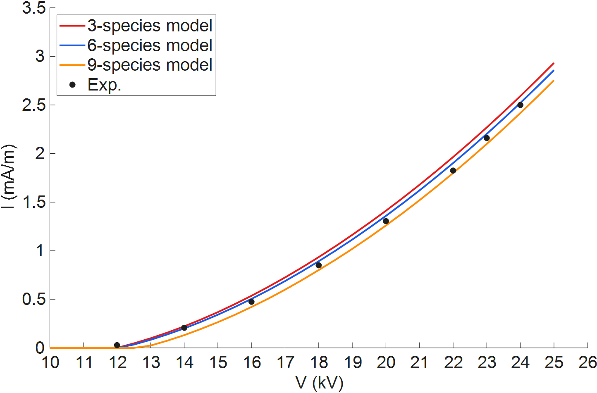

# Positive DC Corona Discharges in Concentric Wire-Cylinder Reactors

This repository contains the code used in the paper:

G. Mongaretto, G. Caliò, F. Ragazzi, A. Popoli, G. Neretti, A. Cristofolini, "Positive DC Corona Discharges in Concentric Wire-Cylinder Reactors: Self-Consistent Modeling and Experimental Validation (submitted for review)

The code reproduces the numerical simulations presented in the paper and provides a computational framework to study positive DC corona discharges in concentric wire-cylinder reactors.

## Quick start: modeling an I-V characteristic
Run the `RUN_ME.m` file in the main project folder. The simulation might take between 20 and 30 minutes depending on the CPU speed.

The following picture should be generated.

## Model description

The model describes the plasma dynamics through a self-consistent fluid formulation for weakly ionized air discharges. The temporal evolution of each species is governed by the continuity equation, where transport is described using the drift-diffusion approximation. In this framework, particle fluxes arise from the combined effect of diffusion and electric-field-driven drift.

The electric field is obtained by solving Poisson’s equation for the electric potential, which couples the charged species dynamics with the electrostatic field generated by the space charge in the discharge.

4 plasma kinetic schemes for dry air can be employed:  
a **3-species, 4-reaction model** [Morrow & Lowke, 1997] including e, ion+, and ion-;  
a **6-species, 13-reaction model** [Parent et al., 2014] including e, N₂, O₂, N₂⁺, O₂⁺, and O₂⁻;  
a **9-species, 26-reaction model** [Kozhevnikov et al., 2023] that adds N, O, and O₄⁺ to the previous scheme.
and a **hybrid model**, which combines the 6- and 9-species models.

Photoionization is included through a Helmholtz-based approximation [Bourdon et al., 2007].

## Numerical implementation

Because of the axial symmetry of the wire-cylinder configuration, the problem is solved in a one-dimensional radial domain extending from the emitter wire to the outer cylindrical electrode.

The governing equations are discretized using a finite volume method on a non-uniform grid. A hyperbolic-tangent stretching function is used to refine the mesh near the wire emitter, where strong electric field gradients and intense ionization occur.

The resulting system of equations is integrated in time using MATLAB's `ode15s` implicit solver.

## Experiments
### r = 50 µm, R = 3.75 cm - configuration (a)  

<table>
  <thead>
    <tr>
      <th colspan="2">p = 1 (atm)</th>
      <th colspan="2">p = 0.8 (atm)</th>
      <th colspan="2">p = 0.6 (atm)</th>
      <th colspan="2">p = 0.4 (atm)</th>
      <th colspan="2">p = 0.2 (atm)</th>
      <th colspan="2">p = 0.1 (atm)</th>
    </tr>
    <tr>
      <th>V (kV)</th><th>I (mA)</th>
      <th>V (kV)</th><th>I (mA)</th>
      <th>V (kV)</th><th>I (mA)</th>
      <th>V (kV)</th><th>I (mA)</th>
      <th>V (kV)</th><th>I (mA)</th>
      <th>V (kV)</th><th>I (mA)</th>
    </tr>
  </thead>
  <tbody>
    <tr><td>6.00</td><td>0.0046</td><td>5.99</td><td>0.0154</td><td>4.20</td><td>0.0169</td><td>3.30</td><td>0.0310</td><td>2.65</td><td>0.0100</td><td>2.10</td><td>0.0400</td></tr>
    <tr><td>8.00</td><td>0.0275</td><td>7.99</td><td>0.0521</td><td>6.01</td><td>0.0241</td><td>6.03</td><td>0.0567</td><td>6.02</td><td>0.123</td><td>4.00</td><td>0.180</td></tr>
    <tr><td>10.0</td><td>0.0623</td><td>9.99</td><td>0.105</td><td>7.98</td><td>0.0694</td><td>7.97</td><td>0.118</td><td>8.01</td><td>0.284</td><td>6.02</td><td>0.397</td></tr>
    <tr><td>12.0</td><td>0.110</td><td>12.0</td><td>0.181</td><td>10.0</td><td>0.138</td><td>10.1</td><td>0.237</td><td>9.99</td><td>0.530</td><td>7.15</td><td>0.659</td></tr>
    <tr><td>14.0</td><td>0.170</td><td>13.9</td><td>0.250</td><td>12.2</td><td>0.237</td><td>12.2</td><td>0.393</td><td>12.0</td><td>0.921</td><td>8.06</td><td>0.946</td></tr>
    <tr><td>16.0</td><td>0.250</td><td>16.1</td><td>0.392</td><td>14.0</td><td>0.340</td><td>14.1</td><td>0.587</td><td>14.0</td><td>1.48</td><td>9.04</td><td>1.37</td></tr>
    <tr><td>18.0</td><td>0.340</td><td>18.1</td><td>0.544</td><td>16.1</td><td>0.490</td><td>16.1</td><td>0.864</td><td>-</td><td>-</td><td>10.0</td><td>1.96</td></tr>
    <tr><td>20.0</td><td>0.450</td><td>19.9</td><td>0.712</td><td>18.0</td><td>0.674</td><td>18.1</td><td>1.22</td><td>-</td><td>-</td><td>-</td><td>-</td></tr>
    <tr><td>22.0</td><td>0.570</td><td>22.0</td><td>0.905</td><td>20.1</td><td>0.920</td><td>20.1</td><td>1.68</td><td>-</td><td>-</td><td>-</td><td>-</td></tr>
    <tr><td>24.0</td><td>0.720</td><td>24.0</td><td>1.14</td><td>22.1</td><td>1.20</td><td>-</td><td>-</td><td>-</td><td>-</td><td>-</td><td>-</td></tr>
    <tr><td>26.0</td><td>0.900</td><td>26.0</td><td>1.51</td><td>24.0</td><td>1.60</td><td>-</td><td>-</td><td>-</td><td>-</td><td>-</td><td>-</td></tr>
    <tr><td>28.0</td><td>1.13</td><td>-</td><td>-</td><td>26.0</td><td>2.10</td><td>-</td><td>-</td><td>-</td><td>-</td><td>-</td><td>-</td></tr>
    <tr><td>29.5</td><td>1.35</td><td>-</td><td>-</td><td>-</td><td>-</td><td>-</td><td>-</td><td>-</td><td>-</td><td>-</td><td>-</td></tr>
  </tbody>
</table>

### r = 300 µm, R = 3.75 cm - configuration (b)

<table>
  <thead>
    <tr>
      <th colspan="2">p = 1 (atm)</th>
    </tr>
    <tr>
      <th>V (kV)</th>
      <th>I (mA)</th>
    </tr>
  </thead>
  <tbody>
    <tr><td>12.0</td><td>0.0057</td></tr>
    <tr><td>14.0</td><td>0.0414</td></tr>
    <tr><td>16.0</td><td>0.0950</td></tr>
    <tr><td>18.0</td><td>0.170</td></tr>
    <tr><td>20.0</td><td>0.261</td></tr>
    <tr><td>22.0</td><td>0.365</td></tr>
    <tr><td>23.0</td><td>0.432</td></tr>
    <tr><td>24.0</td><td>0.500</td></tr>
  </tbody>
</table>

## Citation

If you use this code in your research, please cite:

Positive DC Corona Discharges in Concentric Wire-Cylinder Reactors:  
Self-Consistent Modeling and Experimental Validation (submitted for review)

## References

Morrow, R., & Lowke, J. J. (1997). Streamer propagation in air. *Journal of Physics D: Applied Physics*, 30(4), 614.  
https://doi.org/10.1088/0022-3727/30/4/017

Parent, B., Macheret, S. O., & Shneider, M. N. (2014). Electron and ion transport equations in computational weakly-ionized plasmadynamics. *Journal of Computational Physics*, 259, 51-69.  
https://doi.org/10.1016/j.jcp.2013.11.029

Kozhevnikov, V. Y., et al. (2023). Key modes of ignition and maintenance of corona discharge in air. *Energies*, 16(13), 4861.  
https://doi.org/10.3390/en16134861

Bourdon, A., Pasko, V. P., Liu, N. Y., Célestin, S., Ségur, P., & Marode, E. (2007). Efficient models for photoionization produced by non-thermal gas discharges in air based on radiative transfer and the Helmholtz equations. *Plasma Sources Science and Technology*, 16(3), 656.  
https://doi.org/10.1088/0963-0252/16/3/026
